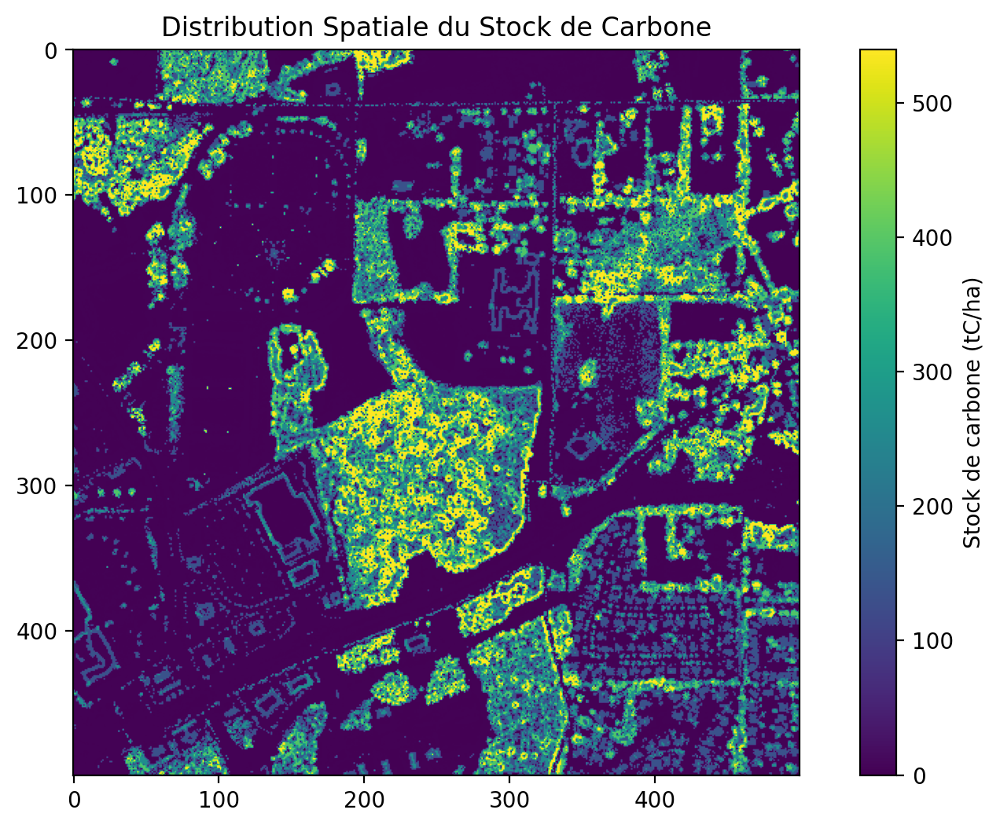

# LiDAR Carbon Stock Analyzer

Cette application Streamlit permet d'analyser des données LiDAR pour estimer le stock de carbone de la végétation.

## Aperçu du système


## Fonctionnalités

- Prétraitement des données LiDAR (fichiers LAS/LAZ)
- Visualisation interactive des nuages de points 3D
- Génération de modèles numériques (DSM, DEM, CHM)
- Classification de la végétation
- Estimation du stock de carbone selon différentes méthodes
- Génération de rapports




## Installation et déploiement

### Prérequis

- Docker et Docker Compose

### Démarrage rapide

1. Clonez ce dépôt
2. Exécutez la commande suivante :

```bash
docker-compose up -d
```

L'application sera disponible à l'adresse http://localhost:8501


## Guide de développement

### Structure du projet

```
├── app.py                  # Point d'entrée de l'application
├── docker-compose.yml      # Configuration Docker Compose
├── Dockerfile             # Configuration Docker
├── modules/               # Modules de l'application
│   ├── carbon_estimation.py    # Estimation du stock de carbone
│   ├── lidar_processing.py     # Traitement des données LiDAR
│   ├── report_generator.py     # Génération de rapports
│   └── visualization.py        # Visualisation des données
├── data/                  # Répertoire pour les données
└── requirements.txt       # Dépendances Python
```

### Configuration

- `TEMP_DIR`: Répertoire temporaire pour les fichiers intermédiaires
- `DATA_DIR`: Répertoire pour les données LiDAR
- `WBT_DIR`: Chemin vers l'exécutable WhiteboxTools


### Dépannage

Si vous rencontrez des erreurs liées à WhiteboxTools, vérifiez que :
1. L'exécutable est correctement installé dans le container
2. Les permissions sont correctes
3. Les répertoires temporaires existent et sont accessibles en écriture


Pour déboguer les problèmes de WhiteboxTools, vous pouvez vous connecter au conteneur :

```bash
docker exec -it lidar-carbon-app bash
```

Et vérifier l'installation :

```bash
whitebox_tools --help
```

## Citation

Si vous utilisez cette application dans vos travaux, veuillez citer :

@misc{njila2025lidar,
  author       = {Donald Njila},
  title        = {lidar\_carbon-main\_lab},
  year         = {2025},
  version      = {1.0},
  howpublished = {\url{https://github.com/falama7/lidar_carbon-main_lab}},
  note         = {Code source GitHub}
}


## Licence

Licence MIT
